- ****** **Partie 1 : paramétrage du MASTER********
 
# wildfly_mode_domain
a configuration of domainwildfly

Comprendre le mode domaine Wildfly


Pour configurer wildfly en mode standalone, j’utiliserai trois machine virtuelle que j’ai crée en utilisant VirtualBox et Vagrant:

```
Vagrant.configure("2") do |config|
  # VM1 Configuration
  config.vm.define "machine1" do |machine1|
    machine1.vm.box = "ubuntu/bionic62"
    machine1.vm.network "private_network", type: "dhcp"
    machine1.vm.network "public_network", type: "dhcp"
	config.vm.boot_timeout = 600
    config.ssh.insert_key = true
  end

  # VM2 Configuration
  config.vm.define "machine2" do |machine2|
    machine2.vm.box = "ubuntu/bionic62"
    machine2.vm.network "private_network", type: "dhcp"
    machine2.vm.network "public_network", type: "dhcp"
	config.vm.boot_timeout = 600
    config.ssh.insert_key = true
  end

  # VM3 Configuration (machine3)
  config.vm.define "machine3" do |machine3|
    machine3.vm.box = "ubuntu/bionic62"
    machine3.vm.network "private_network", type: "dhcp"
	machine3.vm.network "public_network", type: "dhcp"
	config.vm.boot_timeout = 600
    config.ssh.insert_key = true
  end
end
```

Quand on crée les trois vm dans le même réseau  local virtuel, nous aurons: 
- Machine 1: 192.168.56.9 -> rnds.cyberlink.co.id
- Machine 2: 192.168.56.10 -> dmz1.cyberlink.co.id
- Machine 3: 192.168.56.11 -> dmz2.cyberlink.co.id

J’ai rajouté les 3 entrées suivantes dans chaque fichier /etc/hosts de chaque machine


Pour que nslookup peut trouver chaque machine à partir de n’importe quelle autre machine:


La machine 1 va jouer le rôle de contrôleur de domain (master)<br>
La machine 2 va jouer le rôle du contrôleur de host (slave1)<br>
La machine 3 va jouer le rôle du contrôleur de host (slave2)<br>
**Partie 1 : paramétrage du MASTER**
# Aller sur la machine 1:
```bash
root@wildfly:~$ sudo su
root@rnds:~$ cd /opt
root@rnds:~$ mkdir source
root@rnds:~$ cd source
root@rnds:~$ wget https://download.jboss.org/wildfly/13.0.0.Final/wildfly-13.0.0.Final.tar.gz
root@rnds:~$ cd /opt
root@rnds:~$ tar -zxvf source/wildfly-13.0.0.Final.tar.gz -C /opt
root@rnds:~$ mv wildfly-13.0.0.Final/ wildfly
root@rnds:~$ cd wildfly/docs/contrib/scripts/systemd
```


```bash
root@rnds:~$ cat README
```

```bash
 root@rnds:~$ mkdir /etc/wildfly
 root@rnds:~$ cp wildfly.conf /etc/wildfly/
 root@rnds:~$ cp wildfly.service /etc/systemd/system/
 root@rnds:~$ cp launch.sh /opt/wildfly/bin/
 root@rnds:~$ chmod +x /opt/wildfly/bin/launch.sh
 root@rnds:~$ vi /etc/wildfly/wildfly.conf
```
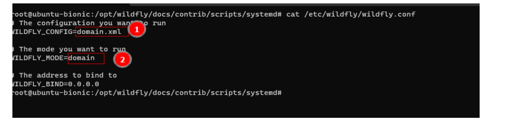
```bash
 root@rnds:~$ vi /etc/systemd/system/wildfly.service
```

```bash
 root@rnds:~$ cd /opt/wildfly/domain/configuration
```

```bash
 root@rnds:~$ cp host.xml host.xml.ori
 root@rnds:~$ cp domain.xml domain.xml.ori
 root@rnds:~$ vi domain.xml
```
Dans la section <server-groups> on ajoute 


```bash
 root@rnds:~$ vi host.xml
```
Supprimer l’attribut par défaut name=”Master” dans la balise domain.
Cela permet d’avoir inheritance-server:none, cela permet au serveur de jouer seulement le rôle de contrôleur de domaine et le rôle de load balancer 

Commentez toute la partie <servers>

```bash
 root@rnds:~$ vi logging.properties
```

```bash
 root@rnds:~$ mkdir /var/log/wildfly.log
 root@rnds:~$ vi  /opt/wildfly/bin/launch.sh
```

```bash
 root@rnds:~$ cd /
 root@rnds:~$  systemctl restart wildfly
 root@rnds:~$  systemctl status wildfly
```

```bash
 root@rnds:~$ netstat -pltn
```


- ****** **Partie 2 : paramétrage du Slave1********

# Aller sur la machine 2:
```bash
root@wildfly:~$ sudo su
root@dmz1:~$ cd /opt
root@dmz1:~$ mkdir source
root@dmz1:~$ cd source
root@dmz1:~$ wget https://download.jboss.org/wildfly/13.0.0.Final/wildfly-13.0.0.Final.tar.gz
root@dmz1:~$ cd /opt
root@dmz1:~$ tar -zxvf source/wildfly-13.0.0.Final.tar.gz -C /opt
root@dmz1:~$ mv wildfly-13.0.0.Final/ wildfly
root@dmz1:~$cd wildfly/docs/contrib/scripts/systemd
```
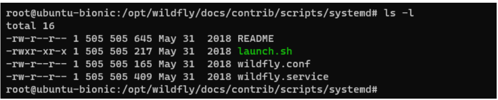
```bash
root@dmz1:~$cat README
```
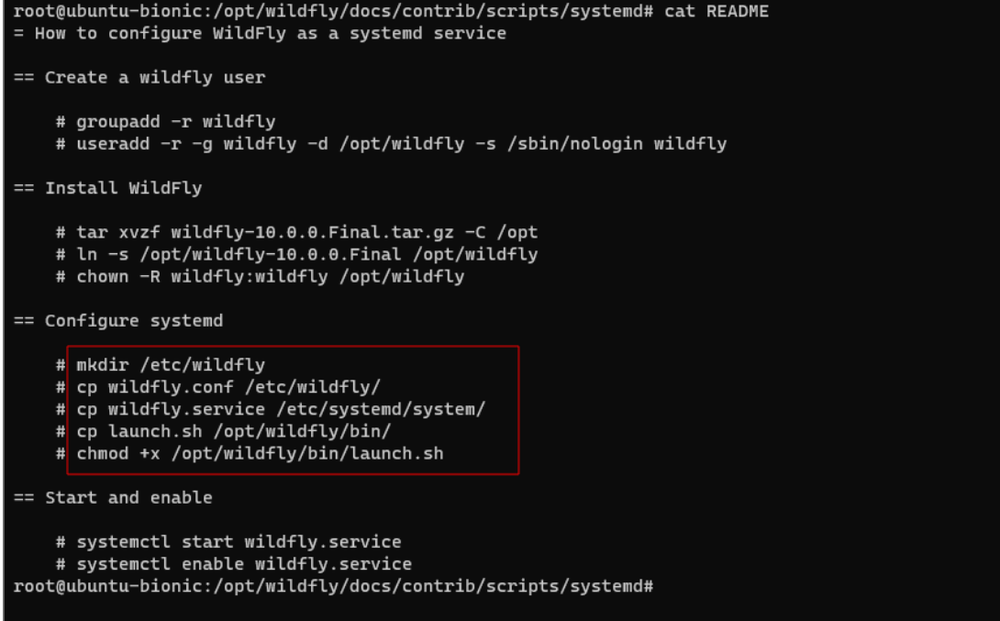

```bash
 root@dmz1:~$ mkdir /etc/wildfly
root@dmz1:~$ cp wildfly.conf /etc/wildfly/
root@dmz1:~$ cp wildfly.service /etc/systemd/system/
root@dmz1:~$cp launch.sh /opt/wildfly/bin/
root@dmz1:~$chmod +x /opt/wildfly/bin/launch.sh
root@dmz1:~$vi /etc/wildfly/wildfly.conf
```
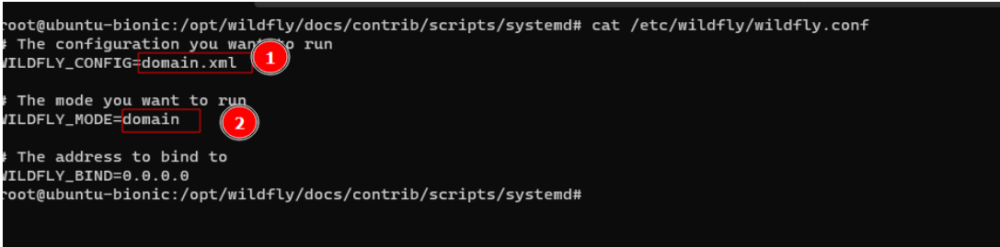
```bash
root@dmz1:~$ vi /etc/systemd/system/wildfly.service
```
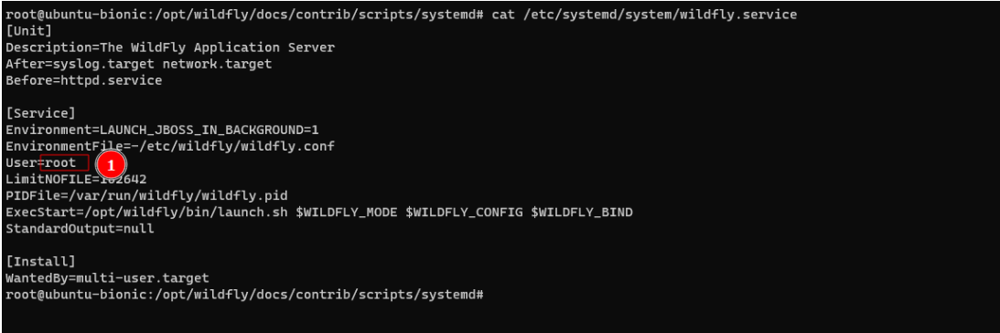
```bash
root@dmz1:~$ cd /opt/wildfly/domain/configuration
```
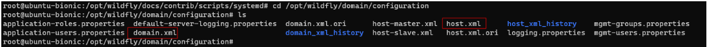

```bash
root@dmz1:~$cp host.xml host.xml.ori
root@dmz1:~$cp host-slave.xml host.xml
root@dmz1:~$vi host.xml
```
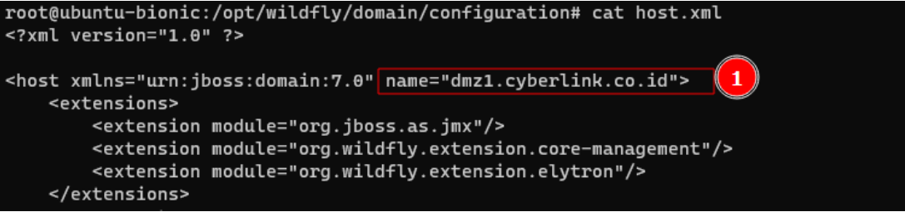

- ****** *Revenir sur la machine1********

```bash
root@rnds:~$cd   /opt/wildfly/bin
root@rnds:~$./add-user.sh
```
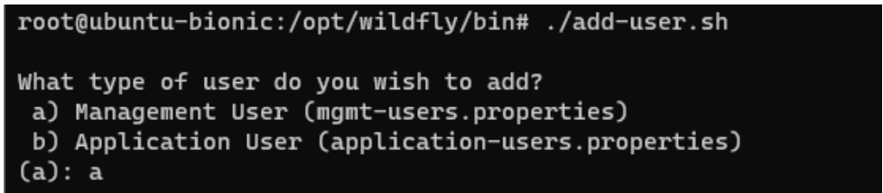
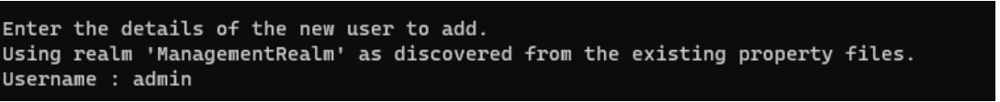
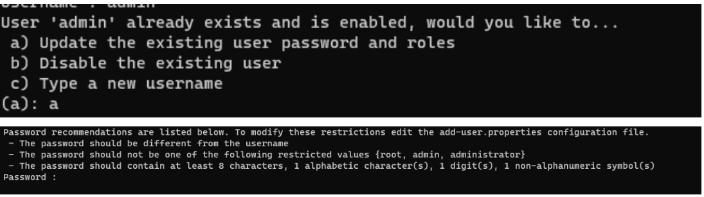
(password =password, même si il est compatible avec le regex wildfly)
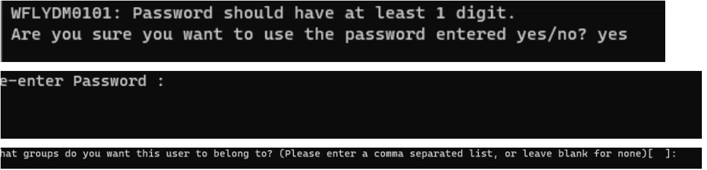
Cliquez sur “entree”
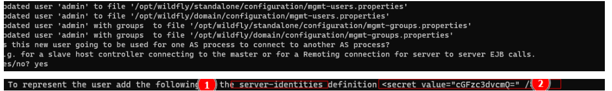

Créer un autre utilisateur : dmz1.cyberlink.co.id

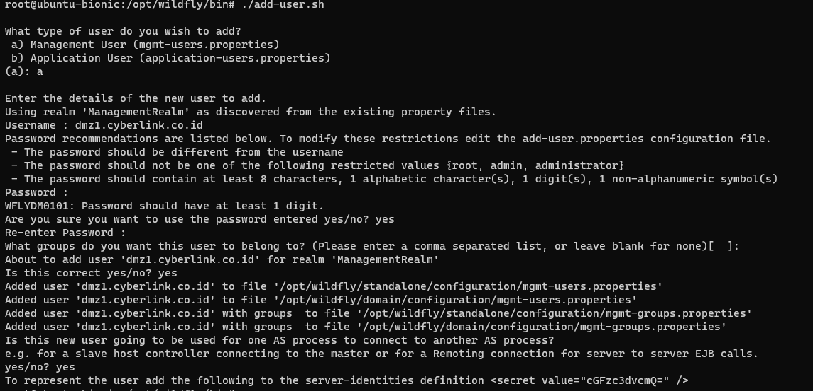
Copier   ```<secret value="cGFzc3dvcmQ=" />``` dans 
 ```<server-identities>```
                 ```<secret value="cGFzc3dvcmQ=" />```
    ```</server-identities> ```

Au niveau de    ```<security-realm name="ManagementRealm">```

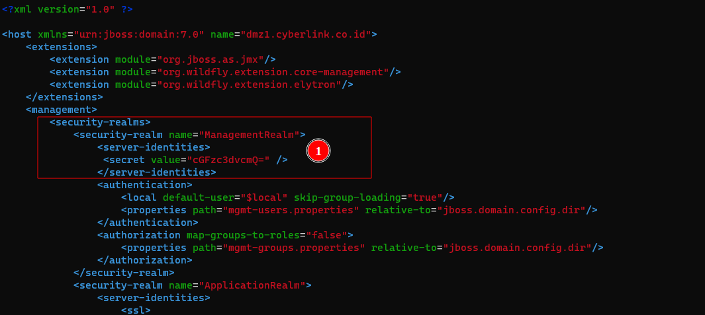

modifier la partie  ``` <servers></servers> ``` en rajoutant
 ```<!-- Host1--> ```
         ```<server name="server-1.dmz1.cyberlink.co.id" group="cyberlink-cluster-group"/>```

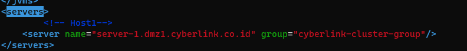

```bash
 root@rnds:~$ vi logging.properties
```
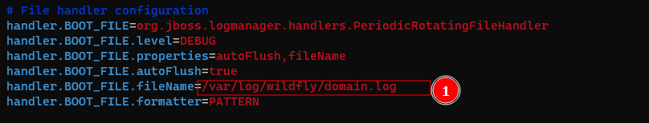
```bash
 root@rnds:~$ mkdir /var/log/wildfly.log
 root@rnds:~$ vi  /opt/wildfly/bin/launch.sh
```
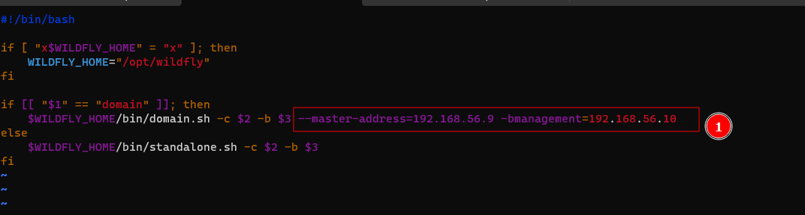
```bash
 root@rnds:~$ cd /
 root@rnds:~$  systemctl restart wildfly
 root@rnds:~$  systemctl status wildfly
```
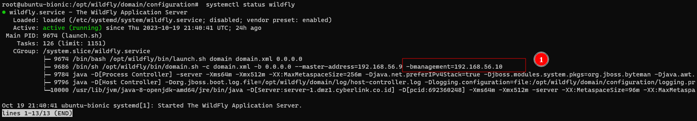

- ****** **Partie 3 : paramétrage du Slave2********

# Aller sur la machine 3:
```bash
root@wildfly:~$ sudo su
root@dmz2:~$ cd /opt
root@dmz2:~$ mkdir source
root@dmz2:~$ cd source
root@dmz2:~$ wget https://download.jboss.org/wildfly/13.0.0.Final/wildfly-13.0.0.Final.tar.gz
root@dmz2:~$ cd /opt
root@dmz2:~$ tar -zxvf source/wildfly-13.0.0.Final.tar.gz -C /opt
root@dmz2:~$ mv wildfly-13.0.0.Final/ wildfly
root@dmz2:~$cd wildfly/docs/contrib/scripts/systemd
```

```bash
root@dmz2:~$cat README
```


```bash
 root@dmz2:~$ mkdir /etc/wildfly
root@dmz2:~$ cp wildfly.conf /etc/wildfly/
root@dmz2:~$ cp wildfly.service /etc/systemd/system/
root@dmz2:~$cp launch.sh /opt/wildfly/bin/
root@dmz2:~$chmod +x /opt/wildfly/bin/launch.sh
root@dmz2:~$vi /etc/wildfly/wildfly.conf
```

```bash
root@dmz2:~$ vi /etc/systemd/system/wildfly.service
```

```bash
root@dmz2:~$ cd /opt/wildfly/domain/configuration
```


```bash
root@dmz2:~$cp host.xml host.xml.ori
root@dmz2:~$cp host-slave.xml host.xml
root@dmz2:~$vi host.xml
```


- ****** *Revenir sur la machine1********

```bash
root@rnds:~$cd   /opt/wildfly/bin
root@rnds:~$./add-user.sh
```


Créer un autre utilisateur : dmz2.cyberlink.co.id


Copier   ```<secret value="cGFzc3dvcmQ=" />``` dans 
 ```<server-identities>```
                 ```<secret value="cGFzc3dvcmQ=" />```
    ```</server-identities> ```

Au niveau de    ```<security-realm name="ManagementRealm">```


modifier la partie  ``` <servers></servers> ``` en rajoutant
 ```<!-- Host2--> ```
         ```<server name="server-2.dmz2.cyberlink.co.id" group="cyberlink-cluster-group"/>```


```bash
 root@dmz2:~$ vi logging.properties
```

```bash
 root@dmz2:~$ mkdir /var/log/wildfly.log
 root@dmz2:~$ vi  /opt/wildfly/bin/launch.sh
```

```bash
 root@dmz2:~$ cd /
 root@dmz2:~$  systemctl restart wildfly
 root@dmz2:~$  systemctl status wildfly
```


